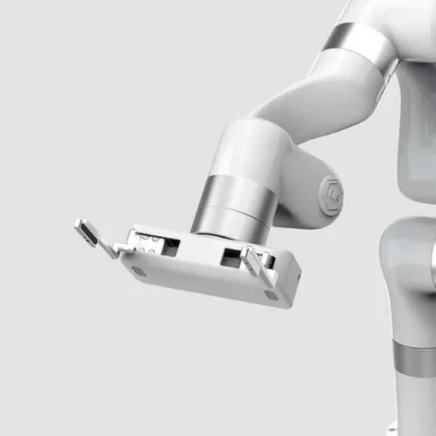

# Démo Bras XArm7

L'idée du sujet est de faire une démo avec le bras XArm7. La démo est libre mais soumise à certains critères.

Les critères fonctionnels sont les suivants :
- Système utile ou très fun
- Agréable / satisfaisant / impressionnant à regarder
- Facilement desinstallable / instable sans nécessité de "repères"
- Rester sur des trajectoires maitrisées, mais pouvant être appelées avec une certaine variabilité.
- Ni dangereux pour le robot / matériel, ni pour les humains
- Possibilité de donner des ordres vocaux pour avoir différents scénarios (et retour vocal).

Les critères technologiques à mettre en oeuvre sont les suivants :
- Mini-usine à concevoir en impression 3D (et éventuellement profilés Alu + plexi)
- Capteurs (detections, mesures, ...) / Actionneurs (E-Aimants, moteurs, lumière, ...) à relier au boitier de commande du bras
- API Python
- Usage d'un LLM : Olama en local, ou API Mistral ou API chatGPT. 

:warning: Les mouvements du bras devront d'abord être testés en simulation. Les mouvements du bras réel ne pourront être effectué que si une personne attentive a sa main au dessus de l'arrêt d'urgence