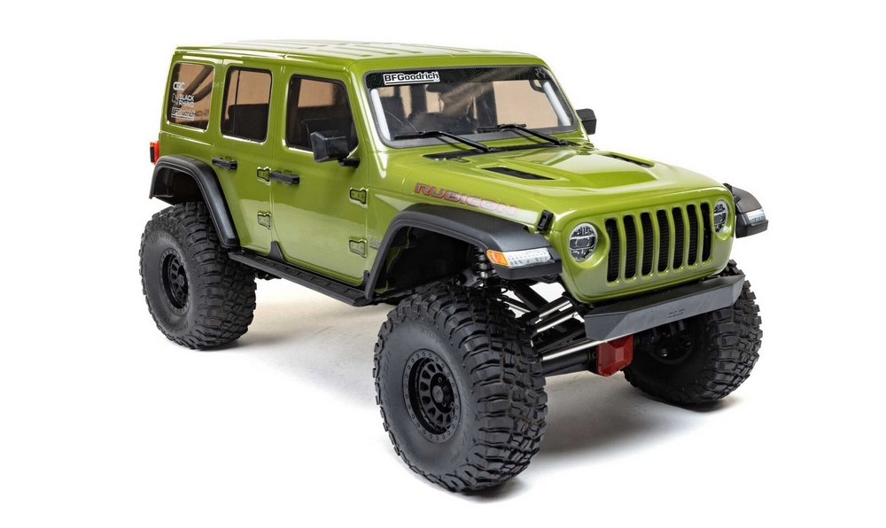
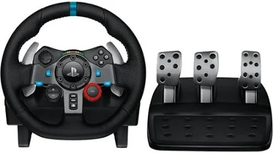

# Autonomisation des Crawler

Une flotte de véhicules Autonomes de type Crawler sont en cour de développement à l'école. Ils permettent d'alimenter les projets de la majeure robotique et pourront avoir un usage en recherche.

Les algorithmes de vision et de navigation sont gérés au semestre 9 avec ROS2 qui tient une place centrale.

La partie électronique communicant sur le bus CAN est plutôt reservée au semestre 8.

3 sous-projets sont possibles :

## Module "Pare-choc avant" avec RADAR + lumières (2 à 3 personnes)

Le module "Pare-choc avant" contient un radar 60Ghz ainsi de les supports pour les phare / feux de croisement / clignotants.

Il s'agit de faire une preuve de concept de l'usage du radar en situation de conduite du véhicule. Par exemple la caractérisation des piétons. Ce radar est relié à un bus FD-CAN.

Il s'agit aussi de programmer la carte CAN qui pilote les feux.

Un boitier (impression 3D) et son intégration sont à prévoir.  Un guide lumière en plexiglas, à usiner à la CNC peut être envisagé.

## Module "Pare-choc arrière" avec ToF (1 à 2 personnes)

Le module "Pare-choc avant" contient 3 capteurs Time-of-Flight, ainsi qu'une caméra de recul. Il s'agit de programmer la carte permettant d'envoyer les données des ToF sur le bus CAN

Un boitier (impression 3D) et son intégration sont à prévoir.   

## Module motorisation et direction (1 personne)

Ce module permet de piloter la motorisation et la direction depuis le bus CAN.
Les essais se seront avec le véhicule sur un pont. Les essais réels seront à faire avec le prof.

Un boitier (impression 3D) et son intégration sont à prévoir.  

## Pilotage volant

Si les 3 modules ci-dessus sont mis en oeuvre, vous pourrez faire une démo de pilotage avec volant et pédales. Vous pourrez aussi ajouter un "bip bip" de fréquence proportionnelle à la distance à l'arrière du véhicule pour la marche arrière.
