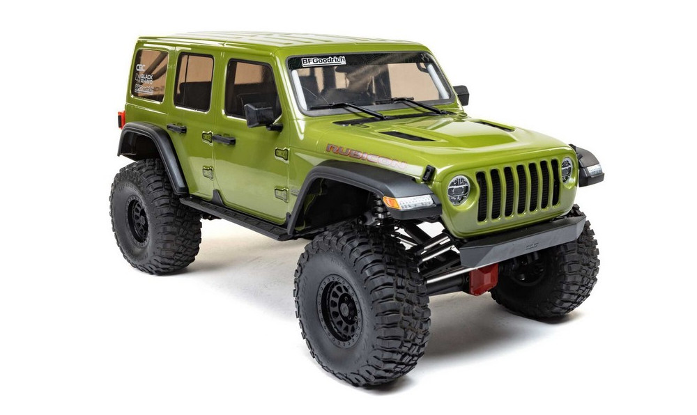
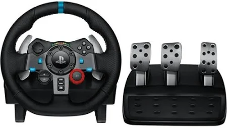

# Autonomisation des Crawler

Une flotte de véhicules Autonomes de type Crawler sont en cour de développement à l'école. Ils permettent d'alimenter les projets de la majeure robotique et pourront avoir un usage en recherche.

Les algorithmes de vision et de navigation sont gérés au semestre 9 avec ROS2 qui tient une place centrale.

La partie électronique communicant sur le bus CAN est plutôt reservée au semestre 8.

3 sous-projets sont possibles :

## Module "Pare-choc avant" 

Le module pare-choc avant intègre un radar et les lumières avant du véhicule.

### RADAR (1 à 2 personnes)  

Le module "Pare-choc avant" contient un radar 60Ghz de référence AWR6843 (équivalent à IWR6843, mais avec la tenue en température pour l'automobile). Il s'agit de faire une preuve de concept de l'usage du radar en situation de conduite du véhicule. Par exemple la caractérisation des piétons. Ce radar est relié à un bus FD-CAN et USB. Un premier PoC est à faire en USB (e.g. https://github.com/kimsooyoung/mmwave_ti_ros). Si le temps le permets, une version CAN pourra être faite.  

### Carte actionneurs/lumières (1 à 2 personnes)  

Il s'agit de programmer la carte CAN qui pilote les feux. Cette carte contient des ponts de puissance et doit pouvoir fonctionner dans différents modes, nottement pour le pilotage de moteurs.  
Un boitier (impression 3D) et son intégration sont à prévoir.  Un guide lumière en plexiglas, à usiner à la CNC peut être envisagé.  

## Module "Pare-choc arrière" avec ToF (1 personne)

Le module "Pare-choc avant" contient 3 capteurs Time-of-Flight VL53L0X, ainsi qu'une caméra de recul. Il s'agit de programmer la carte permettant d'envoyer les données des ToF sur le bus CAN.
Une version fonctionelle est déjà existante, mais il faut changer de paradigme de fonctionnemnt pour atteindre de meilleures performances en passant de 3Hz à 20Hz de rafraichissement.
Plus précisement, il faudra ré-adresser chaque ToF au démarrage pour qu'ils puissent être ensuite communiquer en même temps sur le bus I2C. Pour cela il faudra : 
- Mettre tous les XSHUT à GND → tous les capteurs sont en reset/veille
- Activer le capteur #1 (XSHUT #1 → HIGH)
- Il répond à 0x29 → lui assigner une nouvelle adresse (ex: 0x30)
- Activer le capteur #2 (XSHUT #2 → HIGH)
- Il répond à 0x29 → lui assigner 0x31
- Répéter pour chaque capteur

## Module motorisation et direction (8h)

Ce module est fonctionnel.
Un boitier (impression 3D) et son intégration sont à prévoir.  

## Pilotage volant

Si les 3 modules ci-dessus sont mis en oeuvre, vous pourrez faire une démo de pilotage avec volant et pédales. Vous pourrez aussi ajouter un "bip bip" de fréquence proportionnelle à la distance à l'arrière du véhicule pour la marche arrière.
