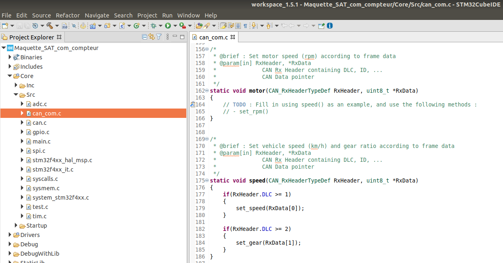

# Sujet2 - SAT+

## En Bref !
1. Faire le pilotage automatique de la voiture à partir de la maquette physique (même code qu'en TP, mais à porter sur STM32)
2. Piloter la voiture du simulateur avsim2D avec volant et pédales:
  - depuis un même PC avec un bus CAN virtuel
  - puis depuis un 2ème PC au travers d'un bus CAN réel (s'arranger avec un autre groupe si pas assez de PCs)
3. En reprenant le programme de la partie 1, lorsque la voiture roule dans le simulateur, le volant doit tourner tout seul

PS : 1 et 2 peuvent être fait indépendament


## Mise en route

### IDE stm32CubeIDE + chargement du code dans la maquette

- [Téléchargez l'archive du projet](https://github.com/cpe-majeure-robotique/S8-Projects/raw/main/ressources/maquettes-sat-student_ver.zip)
- Dezippez là dans `~/STM32CubeIDE/workspace_1.13.2` (ou dossier de votre version de STM32CubeIDE)
- Avec le navigateur de fichier, entrez dans le dossier dezzipé et double cliquez sur le fichier `.project` (si fichier pas visible, faites Ctrl-H)
- L'IDE stm32CubeIDE devrait s'ouvrir
- Configurez le bon Build config comme sur l'mage ci-dessous

- Pour compilez faites `Project -> Build all` (ou Ctrl-B, ou raccourci sur le bandeau)
- Pour charger le programme dans la carte :
  - Mettez la carte sous tension (bloc alim 12V)
  - Branchez la carte Nucléo (blanche) en USB au PC
  - dans stm32CubeIDE cliquez sur le bouton vert avec un triangle blanc (play) pour charger le programme dans la carte
  - Une fois le programme chargé, il est possible de lancer un test de la maquette en appuyant sur le bouton noir (reset) et le bouton bleu (user) en même temps, puis en relâchant le bouton noir en premier

### BUS CAN physique

- plug the USB<->CAN dongle
- in a terminal set up a CAN bus:
```bash
# Replace **** with your USB dongle id
# Configure Serial Line CAN demon 
sudo slcand -o -s6 -t hw -S 3000000 /dev/serial/by-id/usb-Protofusion_Labs_**************** can0

# Mount can0 as a network
sudo ip link set up can0
```
- dans le virtualenv de avsim2D, récupérez le fichier (venv_SAdT/lib/python3.<Xx>/site-packages/avsim2D/)`config.yaml` et copiez le dans `/tmp/avsim2D/` et modifiez le fichier original. Modifiez les paramètres de `can_dbw` de sorte à vous connecter sur can0 avec le bon baudrate

### Compréhension et modification du code la maquette
Le programme fourni permet de faire fonctionner la maquette avec son dashboard, ses commodos, ses bus CAN. Seul quelques lignes de codes ont été supprimées et ce sera à vous de les compléter dès que vous voyez une ligne avec en commentaire `TODO` : 
  
En l'état vous pouvez déjà tester la maquette en envoyant une trame de vitesse depuis un terminal ou avec le simulateur avsim2D (à condition de rediriger vcan0 sur can0)

### Utilisation du volant
- Téléchargez [ce code d'exemple](../ressources/example_wheel.tar.gz) et regardez son README pour le compiler et le lancer
- Voici [la doc du volant](../ressources/dossier_technique.pdf) si besoin
